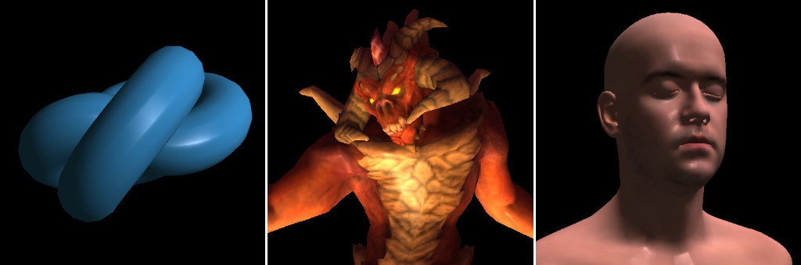

# Software Renderer / Java

Method: scanline rasterizer / gouraud shading.

Edit **run.bat** to set your **JAVA_PATH**. Execute **run.bat** and type **"load 11"**
for a quick load. Type **"list"** for a complete list of all the available models that
you can load. Or, you can type **"help"** for a complete command list.

## Assets used

* African head and Diablo: https://github.com/ssloy/tinyrenderer
* Headscan: http://ir-ltd.net/infinite-3d-head-scan-released
* Cyberpunk car: https://skfb.ly/6QUAI
* Alien: https://skfb.ly/o9HVB
